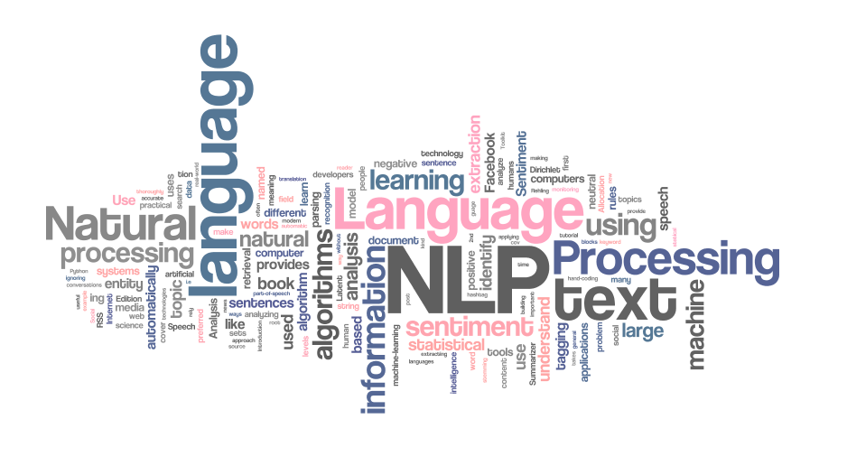

# NLP Projects
Personnal training projects on NLP

### 1.  Kaggle dataset: Coronavirus tweets NLP - Text Classification
<a href="https://www.kaggle.com/victorbnnt/classification-using-lstm-84-accuracy" target="_blank">
Classification using LSTM - 84% accuracy: notebook</a>
